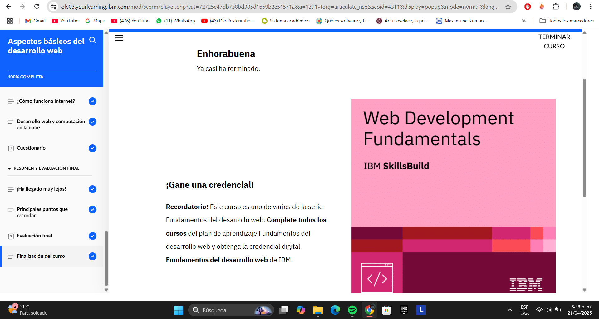
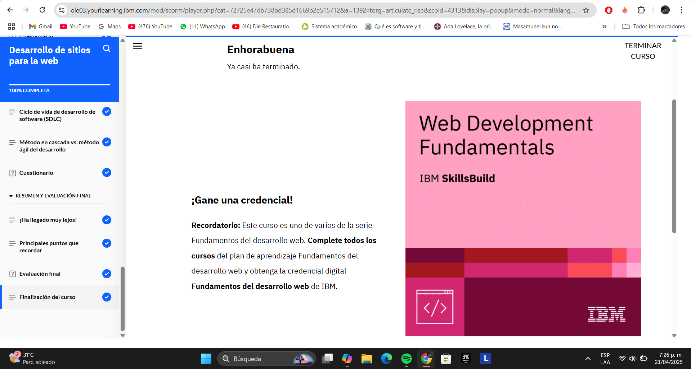
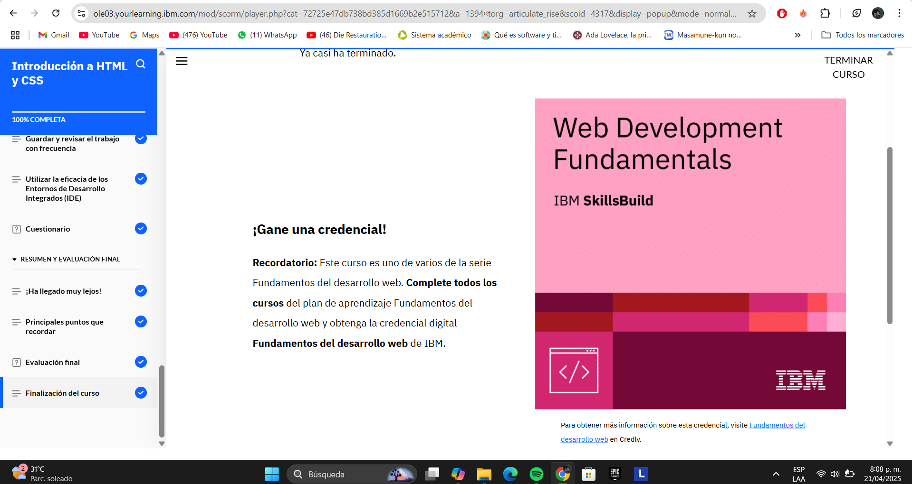
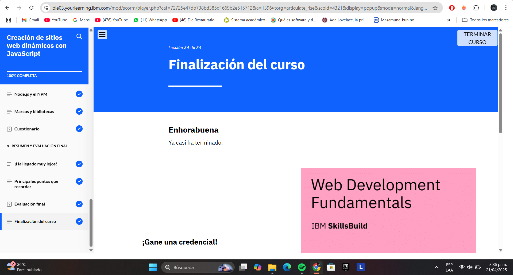
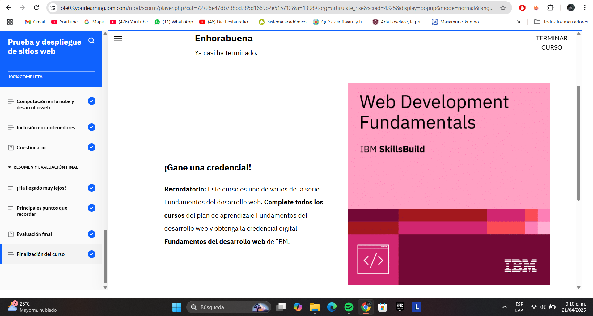
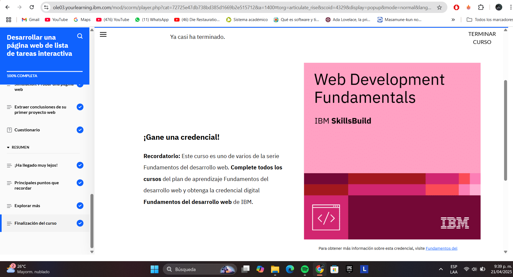
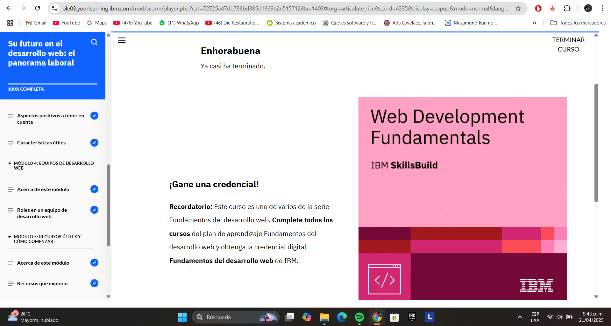
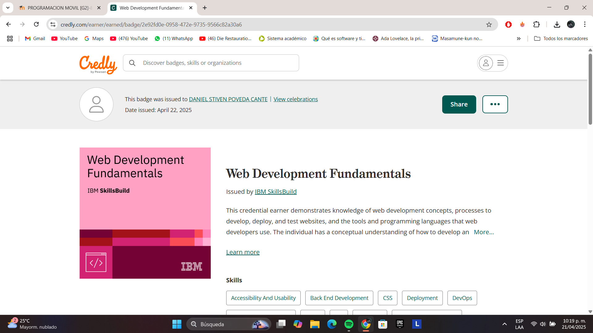

# Fundamentos del desarrollo web - IBM SkillBuild

Este documento contiene la evidencia de finalización de las 7 actividades del curso ofrecido por IBM SkillBuild. Cada sección incluye una descripción reflexiva y un espacio para colocar los pantallazos que demuestran su finalización.

---

## 1. Aspectos básicos del desarrollo web

**Aspectos:**
- ¿Qué es el desarrollo web?
- Diferencia entre frontend y backend
- Herramientas y tecnologías comunes
- Introducción al trabajo de un desarrollador web

**Descripción:**  
En esta primera actividad obtuve una visión general del desarrollo web y sus componentes fundamentales. Aprendí sobre las diferencias entre el frontend (la parte visual de los sitios) y el backend (la lógica que ocurre en el servidor), y comprendí la importancia del trabajo colaborativo en proyectos web. También se introdujeron conceptos clave como navegadores, servidores, protocolos y herramientas de desarrollo. Esta sección fue crucial para entender el panorama completo y sentar las bases para el resto del curso.

**Evidencia:**  

---

## 2. Desarrollo de sitios para la web

**Aspectos:**
- Estructura básica de un sitio web
- Cómo se construyen las páginas
- Navegación, enlaces y estructura de carpetas

**Descripción:**  
Esta actividad me permitió profundizar en la estructura general de los sitios web. Aprendí a organizar correctamente los archivos y carpetas de un proyecto web, a vincular múltiples páginas mediante enlaces y a utilizar elementos clave para crear navegación entre secciones. También entendí la importancia de planificar la experiencia del usuario y mantener una estructura clara y coherente. Este módulo reforzó mi capacidad para estructurar y planificar un sitio desde sus cimientos.

**Evidencia:**  

---

## 3. Introducción a HTML y CSS

**Aspectos:**
- Etiquetas HTML básicas (títulos, párrafos, imágenes, enlaces, listas)
- Selectores y propiedades CSS (colores, fuentes, márgenes, padding)
- Aplicar estilos a una página HTML

**Descripción:**  
En esta sección aprendí a utilizar HTML para estructurar contenido y CSS para darle estilo. Fue uno de los módulos más teoricos, donde pude aprender etiquetas HTML como títulos, párrafos, listas, enlaces, imágenes y formularios, así como estilos en CSS como colores, márgenes, padding y fuentes. Esta actividad me ayudó a visualizar cómo los sitios web cobran vida y cómo los estilos mejoran la presentación y experiencia de usuario.

**Evidencia:**  

---

## 4. Creación de sitios web dinámicos con...

**Aspectos:**
- Hacer sitios más interactivos
- Introducción a scripts o frameworks básicos
- Formularios, validaciones o interactividad

**Descripción:**  
En este módulo se introdujo el concepto de sitios web dinámicos, posiblemente a través de JavaScript o herramientas visuales. Aprendí cómo hacer que los sitios reaccionen a las acciones del usuario, como hacer clic en botones, enviar formularios o cambiar contenido en pantalla. Esta sección me permitió ver cómo agregar interactividad básica, lo cual es esencial para sitios modernos. Me motivó a seguir explorando JavaScript en mayor profundidad.

**Evidencia:**  

---

## 5. Prueba y despliegue de sitios web

**Aspectos:**
- Cómo revisar errores (debugging básico)
- Pruebas en navegadores
- Subir un sitio web a internet

**Descripción:**  
En esta actividad entendí la importancia de probar el funcionamiento de un sitio web antes de publicarlo. Aprendí a inspeccionar errores, probar en diferentes navegadores y asegurarme de que el diseño fuera acorde. Además, exploré opciones para desplegar el sitio en línea. Fue muy útil para conocer herramientas que permiten compartir y mantener un sitio accesible para el público.

**Evidencia:**  

---

## 6. Desarrollar una página web de lista de tareas

**Descripción:**  
Esta fue una actividad muy práctica y completa. Puse en marcha todo lo aprendido anteriormente para crear una aplicación web de lista de tareas. Implementé una estructura HTML, estilos CSS y cierta lógica para permitir al usuario agregar y eliminar tareas. Este proyecto me ayudó a consolidar los conocimientos adquiridos y comprobar que puedo desarrollar una aplicación funcional, aunque sea sencilla.

**Evidencia:**  

---

## 7. Su futuro en el desarrollo web

**Descripción:**  
En esta última parte del curso se exploran las posibles rutas a seguir como desarrollador web. Se presentan consejos sobre cómo armar un portafolio, cómo prepararse para el mercado laboral y qué tecnologías seguir aprendiendo según los intereses personales. También se muestran recursos gratuitos y plataformas para seguir formándose. Es un módulo inspirador que ayuda a planificar los próximos pasos.

**Evidencia:**  

---

## 🏅 Credencial del curso

---
